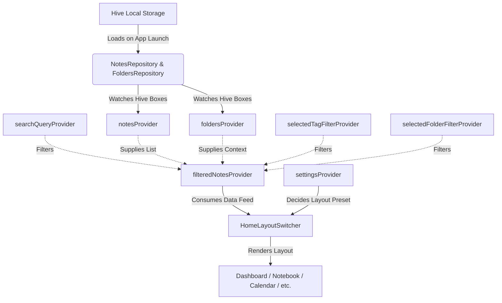

# GentleNotes Home Page Audit: State & Data Connections

The GentleNotes Home screen acts as a central consumer of global application states. It uses **Riverpod** for reactive state updates and **Hive** for persistent local storage, keeping the interface completely synchronized with local file alterations.

---

## 🏗️ State and Data Flow Diagram

---

## 🗳️ Riverpod Providers consumed by Home Screen

The Home Screen UI components read or watch the following state controllers defined in the codebase:

### 1. Primary Data Providers
*   **`notesProvider` (StateNotifierProvider)**: Provides the complete master list of all note records loaded from local Hive storage.
*   **`foldersProvider` (StateNotifierProvider)**: Provides the complete list of folder records. Consumed by components like `FolderListGrid` and `StatsSummaryGrid` to render counts and tags.

### 2. Search & Filter Input State Providers (Mutable)
*   **`searchQueryProvider` (StateProvider<String>)**: Holds the text search query typed into the search bar. Default is empty (`''`).
*   **`selectedTagFilterProvider` (StateProvider<String?>)**: Holds the tag name currently selected in the horizontal tags list. Default is null.
*   **`selectedFolderFilterProvider` (StateProvider<String?>)**: Holds the folder ID to filter the feed. Used to focus notes belonging to a specific folder.
*   **`selectedTypeFilterProvider` (StateProvider<NoteType?>)**: Holds the active note format filter (e.g. text notes, sketch pads, templates).
*   **`filterFavoriteProvider` (StateProvider<bool>)**: Filters notes to show only marked favorites.
*   **`filterPinnedProvider` (StateProvider<bool>)**: Filters notes to show only pinned entries.

---

## ⚡ Reactivity: The `filteredNotesProvider`

Rather than applying ad-hoc filters directly in widget build methods, GentleNotes uses a central, optimized **derived provider**: **`filteredNotesProvider`** (defined in [`notes_controller.dart`](file:///d:/WebProjects/GentleNotes/lib/features/notes/presentation/controllers/notes_controller.dart#L140-L171)).

### Filtering Logic Breakdown:
*   **Recursive Folder Resolution**: If a `folderId` filter is active, the provider:
    1.  Adds the selected folder to the eligible set.
    2.  Invokes `_getDescendantFolderIds(...)` to traverse and add all child folders nested under the parent.
    3.  Filters out notes that do not belong to the selected folder or any of its descendants.
*   **Tokenized Search**: If `searchQuery` is present, it looks for occurrences inside:
    *   Note title.
    *   Note body content (`plainText`).
    *   Individual tags.
    *   Active folder name or parent/ancestor folder names using recursive traversal (`_folderOrAncestorMatches`).
*   **Tag Matching**: Verifies the note's `tags` array contains the selected filter tag.
*   **Metadata Checks**: Filters out notes that do not match active favorite, pinned, or note format parameters.

---

## ⚙️ Layout Configuration Providers

*   **`settingsProvider` (NotifierProvider)**:
    *   Holds user preferences inside the `SettingsModel` (e.g., layout mode settings, dark theme preference, folder visual preference).
    *   `settings.homeLayout` (enum `HomeLayoutPreset`) controls the template switcher.
    *   `settings.layoutMode` (enum `LayoutMode`) determines if the folder list renders in **Grid** mode (2-column layout cards) or **List** mode (horizontal rows).
    *   `ref.read(settingsProvider.notifier).updateLayoutMode(...)` is triggered directly from the Home Screen action headers to swap layout preferences instantly.
